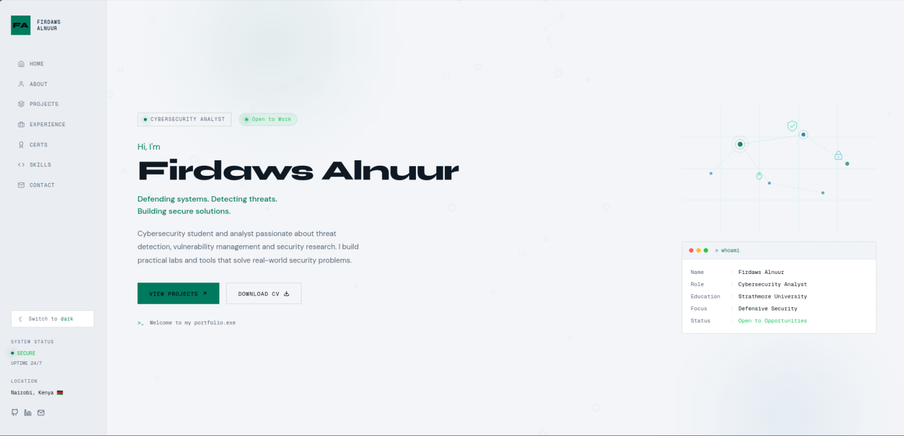

<div align="center">

# Firdaws Alnuur Portfolio

Modern portfolio website showcasing software engineering, cybersecurity, and artificial intelligence projects.

Built with **HTML5**, **CSS3**, and **vanilla JavaScript**, the project demonstrates responsive design, interactive UI, accessibility, and performance-focused frontend engineering without external frameworks.

<p>

<a href="https://firdawsm.github.io/firdawsalnuur.github.io/">

</a>
<a href="LICENSE">

</a>

</p>

</div>

---

## Preview

<p align="center">

</p>

---

# Overview

This repository contains the source code for my personal portfolio website.

The portfolio serves as a central place to showcase my work in Software Engineering, Cybersecurity, Artificial Intelligence, and Detection Engineering through an interactive, responsive, and performance-oriented user experience.

The website includes:

* Software engineering projects
* Cybersecurity labs
* AI applications
* Technical skills
* Certifications
* Professional experience
* Contact information

---

# Design Goals

The project was built around four core engineering principles.

* Performance-first rendering
* Responsive design across all screen sizes
* Clean and maintainable architecture
* Minimal dependencies

Rather than relying on frontend frameworks, the site uses native browser APIs and modern CSS to deliver a lightweight experience.

---

# Features

## User Experience

* Responsive desktop and mobile layouts
* Dark and light themes
* Mobile sidebar navigation
* Active section highlighting
* Smooth scrolling

## Interactive Components

* Hero parallax animation
* Interactive project cards
* Scroll reveal animations
* Animated statistics counters
* Mouse-reactive particle background
* Theme persistence using Local Storage

## Engineering

* Pure HTML, CSS and JavaScript implementation
* Accessibility-aware animations
* Reduced-motion support
* Modular JavaScript architecture
* GitHub Pages deployment
* No runtime dependencies

---

# Technology Stack

| Layer           | Technology                                                  |
| --------------- | ----------------------------------------------------------- |
| Markup          | HTML5                                                       |
| Styling         | CSS3, CSS Variables, Flexbox, CSS Grid                      |
| Programming     | JavaScript (ES6+)                                           |
| Browser APIs    | Intersection Observer, requestAnimationFrame, Local Storage |
| Version Control | Git, GitHub                                                 |
| Deployment      | GitHub Pages                                                |

---

# Project Structure

```text
portfolio/
│
├── assets/
│   ├── images/          Images and illustrations
│   ├── resume/          Resume PDF
│   └── preview.png      README preview image
│
├── css/
│   ├── style.css        Global styles
│   └── responsive.css   Responsive layouts
│
├── js/
│   └── script.js        Interactive UI logic
│
├── index.html
|
└─── README.md
```

---

# Engineering Highlights

* Built without frontend frameworks
* Lightweight architecture with zero runtime dependencies
* Responsive layout using Flexbox and CSS Grid
* Smooth animations powered by requestAnimationFrame
* Scroll-based interactions using Intersection Observer
* Persistent theme preferences with Local Storage
* Interactive cybersecurity-inspired visual effects
* Modular code designed for maintainability

---

# Getting Started

Clone the repository.

```bash
git clone https://github.com/FirdawsM/firdawsalnuur.github.io.git
```

Navigate into the project.

```bash
cd firdawsalnuur.github.io
```

Start a local development server.

```bash
python -m http.server
```

Open your browser.

```text
http://localhost:8000
```

---

# Deployment

The project is deployed using **GitHub Pages**.

Every push to the default branch automatically updates the live website.

Live website:

https://firdawsm.github.io/firdawsalnuur.github.io/

---

# Roadmap

* [ ] Technical blog
* [ ] Interactive project filtering
* [ ] Project case studies
* [ ] Certification gallery
* [ ] Contact form backend
* [ ] Progressive Web App support
* [ ] Lighthouse performance optimization
* [ ] Accessibility improvements

---

# Contributing

Suggestions, improvements, and feedback are always welcome.

---
  
# Author

**Firdaws Alnuur**

Software Engineer • Cybersecurity Engineer • AI Developer

Portfolio
https://firdawsm.github.io/firdawsalnuur.github.io/

LinkedIn
https://www.linkedin.com/in/firdaws-alnuur-b2788722a/

GitHub
https://github.com/FirdawsM

---
# License

This project is licensed under the MIT License.

---
